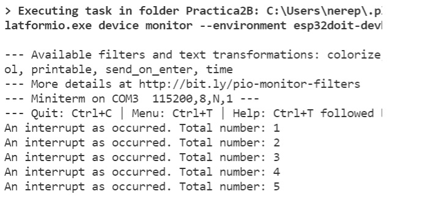

Nerea González
# Pràctica 2B: INTERRUPCIONES
### *Interrupción por timer*

Objetivo: comprender el funcionamiento de las interrupciones 📋

## Funcionalidad de la práctica
---------------------------------
Realizar el informe de funcionamiento asi como las salidas que se obtienen a través de la
impresión serie

```
volatile int interruptCounter;
int totalInterruptCounter;
hw_timer_t * timer = NULL;
portMUX_TYPE timerMux = portMUX_INITIALIZER_UNLOCKED;
void IRAM_ATTR onTimer() {
struct Button {
const uint8_t PIN;
uint32_t numberKeyPresses;
bool pressed;
};
Button button1 = {18, 0, false};
void IRAM_ATTR isr() {
button1.numberKeyPresses += 1;
button1.pressed = true;
}
void setup() {
Serial.begin(115200);
pinMode(button1.PIN, INPUT_PULLUP);
attachInterrupt(button1.PIN, isr, FALLING);
}
void loop() {
if (button1.pressed) {
Serial.printf("Button 1 has been pressed %u times\n", button1.numberKeyPre
button1.pressed = false;
}
//Detach Interrupt after 1 Minute
static uint32_t lastMillis = 0;
if (millis() - lastMillis > 60000) {
lastMillis = millis();
detachInterrupt(button1.PIN);
Serial.println("Interrupt Detached!");
}
}
portENTER_CRITICAL_ISR(&timerMux);
interruptCounter++;
portEXIT_CRITICAL_ISR(&timerMux);
}
void setup() {
Serial.begin(115200);
timer = timerBegin(0, 80, true);
timerAttachInterrupt(timer, &onTimer, true);
timerAlarmWrite(timer, 1000000, true);
timerAlarmEnable(timer);
}
void loop() {
if (interruptCounter > 0) {
portENTER_CRITICAL(&timerMux);
interruptCounter--;
portEXIT_CRITICAL(&timerMux);
totalInterruptCounter++;
Serial.print("An interrupt as occurred. Total number: ");
Serial.println(totalInterruptCounter);
}
}

```
---------------------------------

Variable de contador que se comparte entre el bucle principal y el ISR. Se declara como *volatile*, esto evita que se "elimine" debido a las optimizaciones del compilador. 

```
volatile int interruptCounter;
```

>Esta viariable actúa como contador adicional para contar cuántas interrupciones ya se han producido desde el inicio del programa. 

Esta función solo será utilizada por el bucle principal y, es decir, no es necesario declararlo como volátil.
```
int totalInterruptCounter;
```
Para configurar el temporizador, haremos un puntero a una variable de tipo *hw_timer_t*.
```
hw_timer_t * timer = NULL;
```
Por último, declararemos una variable denominada *portMUX_TYPE* , que utilizaremos para que la sincronización entre el bucle principal y el ISR funcione correctamente. 
```
portMUX_TYPE timerMux = portMUX_INITIALIZER_UNLOCKED;
```
>El atributo *IRAM_ATTR* contiene la función *OnTimer ()*, que se le llama cuando comienza el temporizador a funcionar.

La estructura button tiene tres valores: número de pin, número de pulsaciones de tecla y estado de pulsación. 

```
void IRAM_ATTR onTimer() {
struct Button {
const uint8_t PIN;
uint32_t numberKeyPresses;
bool pressed;
};
```
Creamos una instancia de la estructura Button, inicializamos el número de pin a 18, el número de pulsaciones de teclas a 0 y el estado de pulsación en false (es el estado por defecto).

>Void *IRAM_ATTR*, es una rutina de servicio de interrupción, ISR debería tener el *IRAM_ATTR* de atributo.

En la segunda parte, con el ISR incrementamos en 1 el contador de KeyPresses y establecemos el estado del botón presionado en True.

```
Button button1 = {18, 0, false};
void IRAM_ATTR isr() {
button1.numberKeyPresses += 1;
button1.pressed = true;
}
```
En la sección de configuración del código, es decir el setup, inicializamos la comunicación en serie con la PC. Luego, configuramos el pullup de la entrada en el pin D18.

Después le decimos al ESP32 que supervise el pin D18 y llame a la rutina de servicio de interrupción isr cuando el pin pasa al estado *falling*, es decir, de alto a bajo.

```
void setup() {
Serial.begin(115200);
pinMode(button1.PIN, INPUT_PULLUP);
attachInterrupt(button1.PIN, isr, FALLING);
}
```
Generamos un *loop*. Comprobamos si el estado del botón pulsado vuelve a ser verdadero (true).

>Si esto sucede, se imprime el número de tecla que hemos pulsado,el programa debe imprimir cuántas veces ha sido pulsado. 

```
void loop() {
if (button1.pressed) {
Serial.printf("Button 1 has been pressed %u times\n", button1.numberKeyPre
button1.pressed = false;
}
```
En la sección de bucle contaremos la cantidad de milisegundos que han pasado desde que el programa comenzó a usar la función de *millis()*

Cuando el tiempo es más de 60.000 milisegundos, le decimos a ESP32 que no utilice el pin D18 usando la función *detachInterrupt()*.

```
//Detach Interrupt after 1 Minute
static uint32_t lastMillis = 0;
if (millis() - lastMillis > 60000) {
lastMillis = millis();
detachInterrupt(button1.PIN);
Serial.println("Interrupt Detached!");
}
```
Escribimos la "parte crítica" del código para que el código se ejecute en tiempo real.

```
portENTER_CRITICAL_ISR(&timerMux);
interruptCounter++;
portEXIT_CRITICAL_ISR(&timerMux);
}

```
Inicializamos de nuevo la comunicación en serie con el PC. 

Para inicializar el temporizador utilizamos una función de inicio de temporizador, esta función recibe el número del temporizador que queremos usar. 
>El valor true or false, indica si el contador debe hacer count up o count down, (verdadero) count up o count down(falso). 

En este caso pasaremos verdadero por el último parámentro, por lo tanto contará hacia arriba (count up), una frecuencia de la señal base de 80 MHz. 

> Nos damos cuenta que, si dividimos la señal con una frecuencia de 1MHz, incrementará el contador del temporizador un millón de veces por segundo. 

Antes de esto, deberíamos haber vinculado una función que se ejecutaará cuando se genere la interrupción (con el TimerAttachInterrupt).

```
void setup() {
Serial.begin(115200);
timer = timerBegin(0, 80, true);
timerAttachInterrupt(timer, &onTimer, true);
```

El *timerAlarmWrite* sirve para especificar el valor del contador. Por ello, si queremos pasar la interrupcion de 1 segundo, pasaremos 1^10^6 microsegundos. 

```
timerAlarmWrite(timer, 1000000, true);

```
Para finalizar la función de configuración, llamamos a timerAlarmWrite. 

```
timerAlarmEnable(timer);
}
```

Creamos un bucle. Para verificar el valor del contador de interrupciones, debemos asegurarnos que la variable del contador de interrupciones (interruptCounter) es mayor a cero. 

 Una vez esto suceda, añadiremos el código de interrupciones, es decir, lo primero que haremos será decrementar el contador (--), indicando que la interrupción ha sido reconocida.
 
 Después, se sumarán valores al totalInterruptCounter. 

Se imprimirá por pantalla si se produce una interrupción, mostrando el número total. Además, también se imprimirá el valor totar del totalInterruptCounter, después de hacer la cuenta total.

```
void loop() {
if (interruptCounter > 0) {
portENTER_CRITICAL(&timerMux);
interruptCounter--;
portEXIT_CRITICAL(&timerMux);
totalInterruptCounter++;
Serial.print("An interrupt as occurred. Total number: ");
Serial.println(totalInterruptCounter);
}
}
```


>Respuesta: 

