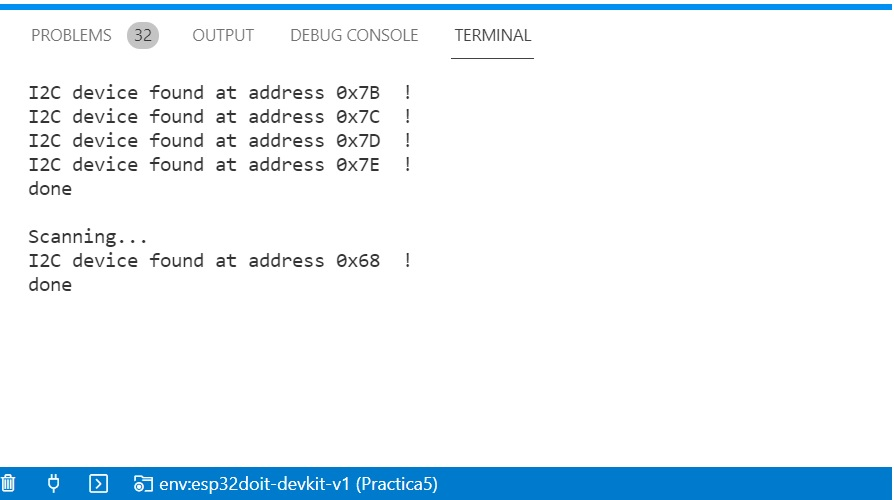

Nerea González 
# Práctica 5: SISTEMAS OPERATIVOS EN TIEMPO REAL

>Objetivo: Comprender el funcionamiento de los buses sistemas de comunicación entre periféricos; estos elementos pueden ser internos o externos al procesador.

La función del bus es permitir la conexión lógica entre los diferentes subsistemas que componen el computador. 

## Funcionalidad de la práctica
---------------------------------
>1. Describir la salida por el puerto serie
>2. Explicar el funcionamiento


>1. Describir la salida por el puerto serie



>2. Este programa permitirá conectar buses al dispositivo. Nos mostrará mensajes de error o de procedimiento correcto. 

```
#include <Arduino.h>
#include <Wire.h>

void setup()
{
  Wire.begin();
 
  Serial.begin(115200);
  while (!Serial);             // Leonardo: wait for serial monitor
  Serial.println("\nI2C Scanner");
}
 
 
void loop()
{
  byte error, address;
  int nDevices;
 
  Serial.println("Scanning...");
 
  nDevices = 0;
  for(address = 1; address < 127; address++ )
  {
    // The i2c_scanner uses the return value of
    // the Write.endTransmisstion to see if
    // a device did acknowledge to the address.
    Wire.beginTransmission(address);
    error = Wire.endTransmission();
 
    if (error == 0)
    {
      Serial.print("I2C device found at address 0x");
      if (address<16)
        Serial.print("0");
      Serial.print(address,HEX);
      Serial.println("  !");
 
      nDevices++;
    }
    else if (error==4)
    {
      Serial.print("Unknown error at address 0x");
      if (address<16)
        Serial.print("0");
      Serial.println(address,HEX);
    }    
  }
  if (nDevices == 0)
    Serial.println("No I2C devices found\n");
  else
    Serial.println("done\n");
 
  delay(5000);           // wait 5 seconds for next scan
}

```
Configuramos las librerías del código. La librería Wire.h nos permitirá comunicarnos con I2C. 
Creamos una función setup, donde iniciaremos Wire.begin para unirnos al bus I2C como master o slave (maestro o esclavo). Normalmente, se debe llamar solo una vez.

Con serial.begin definimos la velocidad de datos en bits por segundo para la transmisión de datos en serie.

En tarjetas con conexión USB directa, como Leonardo, esperan a que el ordenador establezca una "conexión serial activa" (es decir, que el puerto serial sea abierto por una pieza de software).

Se imprimirá "\nI2C Scanner".

```
#include <Arduino.h>
#include <Wire.h>

void setup()
{
  Wire.begin();
 
  Serial.begin(115200);
  while (!Serial);             // Leonardo:wait for serial monitor
  Serial.println("\nI2C Scanner");
}
 
```

Creamos un bucle, que iniciaremos con una variable de error y de dirección. Creamos otra variable de valor entero nDevices, este valor se igualará a 0, nos dirá los dispostivos que hay conectados. 
```
void loop()
{
  byte error, address;
  int nDevices;
 
  Serial.println("Scanning...");
 
  nDevices = 0;
```

Creamos un bucle donde la dirección se igualará a 1 (ya que no puede empezar en 0 porque siempre debe tener un valor), "address" deberá ser menor a 127 e iremos sumando valores cada vez que haga el bucle.

El i2c_scanner utilizará el valor de retorno de la Write.endTransmisstion para ver si un dispositivo reconoció la dirección.

```
  for(address = 1; address < 127; address++ )
  {
    Wire.beginTransmission(address);
    error = Wire.endTransmission();
 ```

Siempre que el erro sea nulo (programamos esto con un condicional), imprimiremos que el dispositivo I2C ha encontrado al dirección 0x. 

Mientras la dirección sea menor a 16, imprimiremos un 0: e imprimiremos la dirección y una exclamación, por lo que sumaremos a nDevices un valor. Esto llevará la cuenta de conexiones al I2C. 

 ```
    if (error == 0)
    {
      Serial.print("I2C device found at address 0x");
      if (address<16)
        Serial.print("0");
      Serial.print(address,HEX);
      Serial.println("  !");
 
      nDevices++;
    }
```
En el caso que el error no sea nulo y sea igual a 4, el dispositivo imprimirá que no reconoce la dirección, lo que supone que si la dirección es menor a 16, se imprimirá por pantalla un 0 y la dirección. 

```
    else if (error==4)
    {
      Serial.print("Unknown error at address 0x");
      if (address<16)
        Serial.print("0");
      Serial.println(address,HEX);
    }    
  }
```

En el caso que no haya dispositivos conectados, se mostrará por pantalla que no hay ningún dispositivo y que no está funcionando. Si esto no sucede, damos el mensaje de proceso correcto. Finalmente habrá una pausa de 5 segundos. 
```
  if (nDevices == 0)
    Serial.println("No I2C devices found\n");
  else
    Serial.println("done\n");
 
  delay(5000);           // wait 5 seconds for next scan
}
```


# A realizar como ejercicio en casa

Realizar un programa que utilice un dispositivo I2C.
Nota:Debido a que no dispongo de otro dispositivo I2C, realizo la misma práctica pero con otro código. 

```
#include <Wire.h>
#include "MAX30105.h"
 
#include "heartRate.h"
 
MAX30105 particleSensor;
 
const byte RATE_SIZE = 4; //Increase this for more averaging. 4 is good.
byte rates[RATE_SIZE]; //Array of heart rates
byte rateSpot = 0;
long lastBeat = 0; //Time at which the last beat occurred
 
float beatsPerMinute;
int beatAvg;
 
void setup()
{
Serial.begin(115200);
Serial.println("Initializing...");
 
// Initialize sensor
if (!particleSensor.begin(Wire, I2C_SPEED_FAST)) //Use default I2C port, 400kHz speed
{
Serial.println("MAX30105 was not found. Please check wiring/power. ");
while (1);
}
Serial.println("Place your index finger on the sensor with steady pressure.");
 
particleSensor.setup(); //Configure sensor with default settings
particleSensor.setPulseAmplitudeRed(0x0A); //Turn Red LED to low to indicate sensor is running
particleSensor.setPulseAmplitudeGreen(0); //Turn off Green LED
}
 
void loop()
{
long irValue = particleSensor.getIR();
 
if (checkForBeat(irValue) == true)
{
//We sensed a beat!
long delta = millis() - lastBeat;
lastBeat = millis();
 
beatsPerMinute = 60 / (delta / 1000.0);
 
if (beatsPerMinute < 255 && beatsPerMinute > 20)
{
rates[rateSpot++] = (byte)beatsPerMinute; //Store this reading in the array
rateSpot %= RATE_SIZE; //Wrap variable
 
//Take average of readings
beatAvg = 0;
for (byte x = 0 ; x < RATE_SIZE ; x++)
beatAvg += rates[x];
beatAvg /= RATE_SIZE;
}
}
 
Serial.print("IR=");
Serial.print(irValue);
Serial.print(", BPM=");
Serial.print(beatsPerMinute);
Serial.print(", Avg BPM=");
Serial.print(beatAvg);
 
if (irValue < 50000)
Serial.print(" No finger?");
 
Serial.println();
}
```

>El esquema que se ha seguido es el siguiente: 


>Realización: 


Una vez ejecutemos el monitor deberemos observar:
IR=111297, BPM=32.68, Avg BPM=64
IR=111451, BPM=32.68, Avg BPM=64