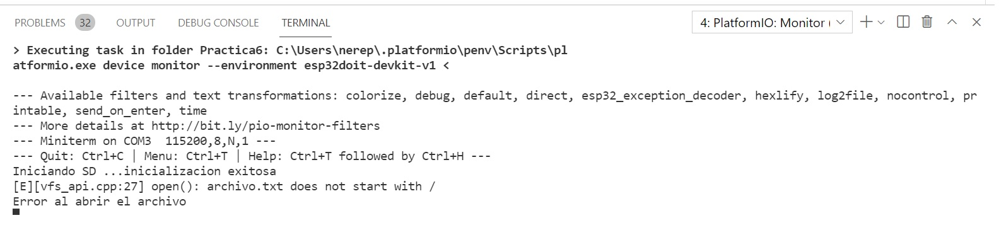
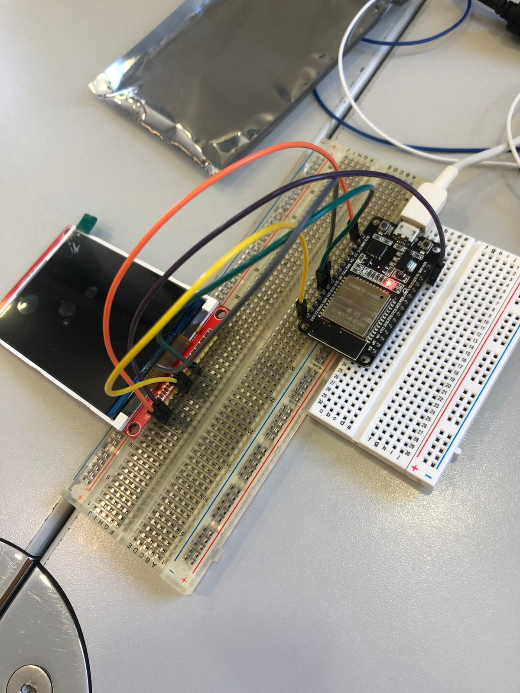
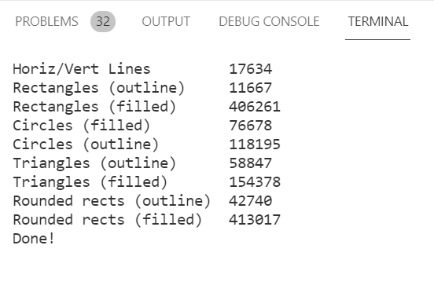

Nerea González 
# Práctica 6: : Buses de comunicación II (SPI)

>Objetivo: Comprender el funcionamiento del bus spi

## Funcionalidad de la práctica
---------------------------------
>1. Describir la salida por el puerto serie
>2. Explicar el funcionamiento

>1. Salida:



>2. Funcionamiento:
```
#include <SPI.h>
#include <SD.h>
File myFile;
void setup()
{
Serial.begin(115200);
Serial.print("Iniciando SD ...");
if (!SD.begin(4)) {
Serial.println("No se pudo inicializar");
return;
}
Serial.println("inicializacion exitosa");
myFile = SD.open("archivo.txt");//abrimos el archivo
if (myFile) {
Serial.println("archivo.txt:");
while (myFile.available()) {
Serial.write(myFile.read());
}
myFile.close(); //cerramos el archivo
} else {
Serial.println("Error al abrir el archivo");
}
}
void loop()
{
}

```

>Implementamos las librerías SPI y SD. Creamos el objeto del archivo con file.
Con Serial.begin indicamos que se inicie la comunicación con el PC con una velocidad de comunicación serial de 115200 bits por segundo (baudios), si esto sucede, se imprimirá "Iniciando SD". Mientras la SD sea diferente a begin (comenzar), se imprimirá "No se pudo inicializar". 

```
#include <SPI.h>
#include <SD.h>
File myFile;
void setup()
{
Serial.begin(9600);
Serial.print("Iniciando SD ...");
if (!SD.begin(4)) {
Serial.println("No se pudo inicializar");
return;
}
```

>Si la inicialización es correcta, se imprimirá "inicialización exitosa".  
Abrimos el archivo. Tenemos en cuenta que sólo podemos abrir un archivo a la vez.

```
Serial.println("inicializacion exitosa");
myFile = SD.open("archivo.txt");//abrimos el archivo
```

>Creamos un condicional: si hemos leído nuestro archivo "myFile", imprimimos "archivo.txt". Creamos
un bucle: mientras el archivo esté disponible, leemos el archivo. 
>Cerraremos el archivo con myfile.close
```
if (myFile) {
Serial.println("archivo.txt:");
while (myFile.available()) {
Serial.write(myFile.read());
}
myFile.close(); //cerramos el archivo
}
```

Si la condición anterior no se cumple, imprimimos "Error al
abrir el archivo". 


```
 else {
Serial.println("Error al abrir el archivo");
}
}
void loop()
{
}
```
> Montaje: 


# EJERCICIO PRÁCTICO 2
>Lectura RFID

Este código se encarga de leer el RFID. 
1) Implementamos las librerías necesarias. Definimos los pines que corresponden con el esp32. 
2) Creamos un objeto. 
3) Iniciamos la comunicación serial. 
4) Iniciamos el bus y el RFID. 
5) Revisamos si hay nuevas tarjetas presentes
6) Seleccionamos una tarjeta
7) Enviamos serialemente su UID
8) Terminamos la lectura de la tarjeta actual

```
#include <SPI.h>
#include <MFRC522.h>
#define RST_PIN 4
#define SS_PIN 15 
MFRC522 mfrc522(SS_PIN, RST_PIN); 
void setup() {
Serial.begin(9600); 
SPI.begin(); 
mfrc522.PCD_Init();  
Serial.println("Lectura del UID");
}
void loop() {

if ( mfrc522.PICC_IsNewCardPresent())
{

if ( mfrc522.PICC_ReadCardSerial())
{

Serial.print("Card UID:");
for (byte i = 0; i < mfrc522.uid.size; i++) {
Serial.print(mfrc522.uid.uidByte[i] < 0x10 ? " 0" : " ");
Serial.print(mfrc522.uid.uidByte[i], HEX);
}
Serial.println(); 
mfrc522.PICC_HaltA();
}
}
```
# EJERCICIO PRÁCTICO 3

Necesario presentar en el informe
1. fotos del montaje
2. salidas de depuracion ( print...)
3. codigo generado
4. explicación del codigo

> 1. Fotos del montaje



>2. Salidas de depuracion ( print...)




>3. Código generado

```
#include "SPI.h"
#include "Adafruit_GFX.h"
#include "Adafruit_ILI9341.h"
#include <Adafruit_I2CDevice.h>

#define I2C_ADDRESS 0x60
// For the Adafruit shield, these are the default.
#define TFT_DC 15
#define TFT_CS 5
#define TFT_RST 4
#define TFT_MOSI 23
#define TFT_CLK 18
#define TFT_MISO 19
// Use hardware SPI (on Uno, #13, #12, #11) and the above for CS/DC
Adafruit_ILI9341 tft = Adafruit_ILI9341(TFT_CS, TFT_DC,TFT_RST,TFT_MOSI,TFT_CLK,TFT_MISO);
// If using the breakout, change pins as desired
//Adafruit_ILI9341 tft = Adafruit_ILI9341(TFT_CS, TFT_DC, TFT_MOSI, TFT_CLK, TFT_RST, TFT_MISO);
unsigned long testFillScreen() {
  unsigned long start = micros();
  tft.fillScreen(ILI9341_BLACK);
  yield();
  tft.fillScreen(ILI9341_RED);
  yield();
  tft.fillScreen(ILI9341_GREEN);
  yield();
  tft.fillScreen(ILI9341_BLUE);
  yield();
  tft.fillScreen(ILI9341_BLACK);
  yield();
  return micros() - start;
}

unsigned long testText() {
  tft.fillScreen(ILI9341_BLACK);
  unsigned long start = micros();
  tft.setCursor(0, 0);
  tft.setTextColor(ILI9341_WHITE);  tft.setTextSize(1);
  tft.println("Hello World!");
  tft.setTextColor(ILI9341_YELLOW); tft.setTextSize(2);
  tft.println(1234.56);
  tft.setTextColor(ILI9341_RED);    tft.setTextSize(3);
  tft.println(0xDEADBEEF, HEX);
  tft.println();
  tft.setTextColor(ILI9341_GREEN);
  tft.setTextSize(5);
  tft.println("Groop");
  tft.setTextSize(2);
  tft.println("I implore thee,");
  tft.setTextSize(1);
  tft.println("my foonting turlingdromes.");
  tft.println("And hooptiously drangle me");
  tft.println("with crinkly bindlewurdles,");
  tft.println("Or I will rend thee");
  tft.println("in the gobberwarts");
  tft.println("with my blurglecruncheon,");
  tft.println("see if I don't!");
  return micros() - start;
}

unsigned long testLines(uint16_t color) {
  unsigned long start, t;
  int           x1, y1, x2, y2,
                w = tft.width(),
                h = tft.height();

  tft.fillScreen(ILI9341_BLACK);
  yield();
  
  x1 = y1 = 0;
  y2    = h - 1;
  start = micros();
  for(x2=0; x2<w; x2+=6) tft.drawLine(x1, y1, x2, y2, color);
  x2    = w - 1;
  for(y2=0; y2<h; y2+=6) tft.drawLine(x1, y1, x2, y2, color);
  t     = micros() - start; // fillScreen doesn't count against timing

  yield();
  tft.fillScreen(ILI9341_BLACK);
  yield();

  x1    = w - 1;
  y1    = 0;
  y2    = h - 1;
  start = micros();
  for(x2=0; x2<w; x2+=6) tft.drawLine(x1, y1, x2, y2, color);
  x2    = 0;
  for(y2=0; y2<h; y2+=6) tft.drawLine(x1, y1, x2, y2, color);
  t    += micros() - start;

  yield();
  tft.fillScreen(ILI9341_BLACK);
  yield();

  x1    = 0;
  y1    = h - 1;
  y2    = 0;
  start = micros();
  for(x2=0; x2<w; x2+=6) tft.drawLine(x1, y1, x2, y2, color);
  x2    = w - 1;
  for(y2=0; y2<h; y2+=6) tft.drawLine(x1, y1, x2, y2, color);
  t    += micros() - start;

  yield();
  tft.fillScreen(ILI9341_BLACK);
  yield();

  x1    = w - 1;
  y1    = h - 1;
  y2    = 0;
  start = micros();
  for(x2=0; x2<w; x2+=6) tft.drawLine(x1, y1, x2, y2, color);
  x2    = 0;
  for(y2=0; y2<h; y2+=6) tft.drawLine(x1, y1, x2, y2, color);

  yield();
  return micros() - start;
}

unsigned long testFastLines(uint16_t color1, uint16_t color2) {
  unsigned long start;
  int           x, y, w = tft.width(), h = tft.height();

  tft.fillScreen(ILI9341_BLACK);
  start = micros();
  for(y=0; y<h; y+=5) tft.drawFastHLine(0, y, w, color1);
  for(x=0; x<w; x+=5) tft.drawFastVLine(x, 0, h, color2);

  return micros() - start;
}

unsigned long testRects(uint16_t color) {
  unsigned long start;
  int           n, i, i2,
                cx = tft.width()  / 2,
                cy = tft.height() / 2;

  tft.fillScreen(ILI9341_BLACK);
  n     = min(tft.width(), tft.height());
  start = micros();
  for(i=2; i<n; i+=6) {
    i2 = i / 2;
    tft.drawRect(cx-i2, cy-i2, i, i, color);
  }

  return micros() - start;
}

unsigned long testFilledRects(uint16_t color1, uint16_t color2) {
  unsigned long start, t = 0;
  int           n, i, i2,
                cx = tft.width()  / 2 - 1,
                cy = tft.height() / 2 - 1;

  tft.fillScreen(ILI9341_BLACK);
  n = min(tft.width(), tft.height());
  for(i=n; i>0; i-=6) {
    i2    = i / 2;
    start = micros();
    tft.fillRect(cx-i2, cy-i2, i, i, color1);
    t    += micros() - start;
    // Outlines are not included in timing results
    tft.drawRect(cx-i2, cy-i2, i, i, color2);
    yield();
  }

  return t;
}

unsigned long testFilledCircles(uint8_t radius, uint16_t color) {
  unsigned long start;
  int x, y, w = tft.width(), h = tft.height(), r2 = radius * 2;

  tft.fillScreen(ILI9341_BLACK);
  start = micros();
  for(x=radius; x<w; x+=r2) {
    for(y=radius; y<h; y+=r2) {
      tft.fillCircle(x, y, radius, color);
    }
  }

  return micros() - start;
}

unsigned long testCircles(uint8_t radius, uint16_t color) {
  unsigned long start;
  int           x, y, r2 = radius * 2,
                w = tft.width()  + radius,
                h = tft.height() + radius;

  // Screen is not cleared for this one -- this is
  // intentional and does not affect the reported time.
  start = micros();
  for(x=0; x<w; x+=r2) {
    for(y=0; y<h; y+=r2) {
      tft.drawCircle(x, y, radius, color);
    }
  }

  return micros() - start;
}

unsigned long testTriangles() {
  unsigned long start;
  int           n, i, cx = tft.width()  / 2 - 1,
                      cy = tft.height() / 2 - 1;

  tft.fillScreen(ILI9341_BLACK);
  n     = min(cx, cy);
  start = micros();
  for(i=0; i<n; i+=5) {
    tft.drawTriangle(
      cx    , cy - i, // peak
      cx - i, cy + i, // bottom left
      cx + i, cy + i, // bottom right
      tft.color565(i, i, i));
  }

  return micros() - start;
}

unsigned long testFilledTriangles() {
  unsigned long start, t = 0;
  int           i, cx = tft.width()  / 2 - 1,
                   cy = tft.height() / 2 - 1;

  tft.fillScreen(ILI9341_BLACK);
  start = micros();
  for(i=min(cx,cy); i>10; i-=5) {
    start = micros();
    tft.fillTriangle(cx, cy - i, cx - i, cy + i, cx + i, cy + i,
      tft.color565(0, i*10, i*10));
    t += micros() - start;
    tft.drawTriangle(cx, cy - i, cx - i, cy + i, cx + i, cy + i,
      tft.color565(i*10, i*10, 0));
    yield();
  }

  return t;
}

unsigned long testRoundRects() {
  unsigned long start;
  int           w, i, i2,
                cx = tft.width()  / 2 - 1,
                cy = tft.height() / 2 - 1;

  tft.fillScreen(ILI9341_BLACK);
  w     = min(tft.width(), tft.height());
  start = micros();
  for(i=0; i<w; i+=6) {
    i2 = i / 2;
    tft.drawRoundRect(cx-i2, cy-i2, i, i, i/8, tft.color565(i, 0, 0));
  }

  return micros() - start;
}

unsigned long testFilledRoundRects() {
  unsigned long start;
  int           i, i2,
                cx = tft.width()  / 2 - 1,
                cy = tft.height() / 2 - 1;

  tft.fillScreen(ILI9341_BLACK);
  start = micros();
  for(i=min(tft.width(), tft.height()); i>20; i-=6) {
    i2 = i / 2;
    tft.fillRoundRect(cx-i2, cy-i2, i, i, i/8, tft.color565(0, i, 0));
    yield();
  }

  return micros() - start;
}


void setup() {
  Serial.begin(115200);
  Serial.println("ILI9341 Test!"); 
 
  tft.begin();

  // read diagnostics (optional but can help debug problems)
  uint8_t x = tft.readcommand8(ILI9341_RDMODE);
  Serial.print("Display Power Mode: 0x"); Serial.println(x, HEX);
  x = tft.readcommand8(ILI9341_RDMADCTL);
  Serial.print("MADCTL Mode: 0x"); Serial.println(x, HEX);
  x = tft.readcommand8(ILI9341_RDPIXFMT);
  Serial.print("Pixel Format: 0x"); Serial.println(x, HEX);
  x = tft.readcommand8(ILI9341_RDIMGFMT);
  Serial.print("Image Format: 0x"); Serial.println(x, HEX);
  x = tft.readcommand8(ILI9341_RDSELFDIAG);
  Serial.print("Self Diagnostic: 0x"); Serial.println(x, HEX); 
  
  Serial.println(F("Benchmark                Time (microseconds)"));
  delay(10);
  Serial.print(F("Screen fill"));
  Serial.println(testFillScreen());
  delay(500);

  Serial.print(F("Text                     "));
  Serial.println(testText());
  delay(3000);

  Serial.print(F("Lines                    "));
  Serial.println(testLines(ILI9341_CYAN));
  delay(500);

  Serial.print(F("Horiz/Vert Lines         "));
  Serial.println(testFastLines(ILI9341_RED, ILI9341_BLUE));
  delay(500);

  Serial.print(F("Rectangles (outline)     "));
  Serial.println(testRects(ILI9341_GREEN));
  delay(500);

  Serial.print(F("Rectangles (filled)      "));
  Serial.println(testFilledRects(ILI9341_YELLOW, ILI9341_MAGENTA));
  delay(500);

  Serial.print(F("Circles (filled)         "));
  Serial.println(testFilledCircles(10, ILI9341_MAGENTA));

  Serial.print(F("Circles (outline)        "));
  Serial.println(testCircles(10, ILI9341_WHITE));
  delay(500);

  Serial.print(F("Triangles (outline)      "));
  Serial.println(testTriangles());
  delay(500);

  Serial.print(F("Triangles (filled)       "));
  Serial.println(testFilledTriangles());
  delay(500);

  Serial.print(F("Rounded rects (outline)  "));
  Serial.println(testRoundRects());
  delay(500);

  Serial.print(F("Rounded rects (filled)   "));
  Serial.println(testFilledRoundRects());
  delay(500);

  Serial.println(F("Done!"));

}


void loop(void) {
  for(uint8_t rotation=0; rotation<4; rotation++) {
    tft.setRotation(rotation);
    testText();
    delay(1000);
  }
}

```

>4. Explicación del codigo


Incluimos las librerías necesarias. Descargaremos en platformio.io las librerías correspondientes. 

Definimos los pines que utilizaremos en nuestra ESP32. 

```
#include "SPI.h"
#include "Adafruit_GFX.h"
#include "Adafruit_ILI9341.h"
#include <Adafruit_I2CDevice.h>

#define I2C_ADDRESS 0x60
// For the Adafruit shield, these are the default.
#define TFT_DC 15
#define TFT_CS 5
#define TFT_RST 4
#define TFT_MOSI 23
#define TFT_CLK 18
#define TFT_MISO 19

```

Incluimos los nombre de los pines en las librerías Adafruit_ILI9341. 

```
// Use hardware SPI (on Uno, #13, #12, #11) and the above for CS/DC
Adafruit_ILI9341 tft = Adafruit_ILI9341(TFT_CS, TFT_DC,TFT_RST,TFT_MOSI,TFT_CLK,TFT_MISO);
// If using the breakout, change pins as desired
//Adafruit_ILI9341 tft = Adafruit_ILI9341(TFT_CS, TFT_DC, TFT_MOSI, TFT_CLK, TFT_RST, TFT_MISO);

```

Definimos los colores que observaremos y escribimos lo que queremos imprimir por pantalla. 

```
unsigned long testFillScreen() {
  unsigned long start = micros();
  tft.fillScreen(ILI9341_BLACK);
  yield();
  tft.fillScreen(ILI9341_RED);
  yield();
  tft.fillScreen(ILI9341_GREEN);
  yield();
  tft.fillScreen(ILI9341_BLUE);
  yield();
  tft.fillScreen(ILI9341_BLACK);
  yield();
  return micros() - start;
}

unsigned long testText() {
  tft.fillScreen(ILI9341_BLACK);
  unsigned long start = micros();
  tft.setCursor(0, 0);
  tft.setTextColor(ILI9341_WHITE);  tft.setTextSize(1);
  tft.println("Hello World!");
  tft.setTextColor(ILI9341_YELLOW); tft.setTextSize(2);
  tft.println(1234.56);
  tft.setTextColor(ILI9341_RED);    tft.setTextSize(3);
  tft.println(0xDEADBEEF, HEX);
  tft.println();
  tft.setTextColor(ILI9341_GREEN);
  tft.setTextSize(5);
  tft.println("Groop");
  tft.setTextSize(2);
  tft.println("I implore thee,");
  tft.setTextSize(1);
  tft.println("my foonting turlingdromes.");
  tft.println("And hooptiously drangle me");
  tft.println("with crinkly bindlewurdles,");
  tft.println("Or I will rend thee");
  tft.println("in the gobberwarts");
  tft.println("with my blurglecruncheon,");
  tft.println("see if I don't!");
  return micros() - start;
}
```


Definiremos todo aquello que queremos mostrar: 
altura, color, cuándo comenzará a dibujar por pantalla... 
```
unsigned long testLines(uint16_t color) {
  unsigned long start, t;
  int           x1, y1, x2, y2,
                w = tft.width(),
                h = tft.height();

  tft.fillScreen(ILI9341_BLACK);
  yield();
  
  x1 = y1 = 0;
  y2    = h - 1;
  start = micros();
  for(x2=0; x2<w; x2+=6) tft.drawLine(x1, y1, x2, y2, color);
  x2    = w - 1;
  for(y2=0; y2<h; y2+=6) tft.drawLine(x1, y1, x2, y2, color);
  t     = micros() - start; // fillScreen doesn't count against timing

  yield();
  tft.fillScreen(ILI9341_BLACK);
  yield();

  x1    = w - 1;
  y1    = 0;
  y2    = h - 1;
  start = micros();
  for(x2=0; x2<w; x2+=6) tft.drawLine(x1, y1, x2, y2, color);
  x2    = 0;
  for(y2=0; y2<h; y2+=6) tft.drawLine(x1, y1, x2, y2, color);
  t    += micros() - start;

  yield();
  tft.fillScreen(ILI9341_BLACK);
  yield();

  x1    = 0;
  y1    = h - 1;
  y2    = 0;
  start = micros();
  for(x2=0; x2<w; x2+=6) tft.drawLine(x1, y1, x2, y2, color);
  x2    = w - 1;
  for(y2=0; y2<h; y2+=6) tft.drawLine(x1, y1, x2, y2, color);
  t    += micros() - start;

  yield();
  tft.fillScreen(ILI9341_BLACK);
  yield();

  x1    = w - 1;
  y1    = h - 1;
  y2    = 0;
  start = micros();
  for(x2=0; x2<w; x2+=6) tft.drawLine(x1, y1, x2, y2, color);
  x2    = 0;
  for(y2=0; y2<h; y2+=6) tft.drawLine(x1, y1, x2, y2, color);

  yield();
  return micros() - start;
}

unsigned long testFastLines(uint16_t color1, uint16_t color2) {
  unsigned long start;
  int           x, y, w = tft.width(), h = tft.height();

  tft.fillScreen(ILI9341_BLACK);
  start = micros();
  for(y=0; y<h; y+=5) tft.drawFastHLine(0, y, w, color1);
  for(x=0; x<w; x+=5) tft.drawFastVLine(x, 0, h, color2);

  return micros() - start;
}

unsigned long testRects(uint16_t color) {
  unsigned long start;
  int           n, i, i2,
                cx = tft.width()  / 2,
                cy = tft.height() / 2;

  tft.fillScreen(ILI9341_BLACK);
  n     = min(tft.width(), tft.height());
  start = micros();
  for(i=2; i<n; i+=6) {
    i2 = i / 2;
    tft.drawRect(cx-i2, cy-i2, i, i, color);
  }

  return micros() - start;
}

unsigned long testFilledRects(uint16_t color1, uint16_t color2) {
  unsigned long start, t = 0;
  int           n, i, i2,
                cx = tft.width()  / 2 - 1,
                cy = tft.height() / 2 - 1;

  tft.fillScreen(ILI9341_BLACK);
  n = min(tft.width(), tft.height());
  for(i=n; i>0; i-=6) {
    i2    = i / 2;
    start = micros();
    tft.fillRect(cx-i2, cy-i2, i, i, color1);
    t    += micros() - start;
    // Outlines are not included in timing results
    tft.drawRect(cx-i2, cy-i2, i, i, color2);
    yield();
  }

  return t;
}

unsigned long testFilledCircles(uint8_t radius, uint16_t color) {
  unsigned long start;
  int x, y, w = tft.width(), h = tft.height(), r2 = radius * 2;

  tft.fillScreen(ILI9341_BLACK);
  start = micros();
  for(x=radius; x<w; x+=r2) {
    for(y=radius; y<h; y+=r2) {
      tft.fillCircle(x, y, radius, color);
    }
  }

  return micros() - start;
}

unsigned long testCircles(uint8_t radius, uint16_t color) {
  unsigned long start;
  int           x, y, r2 = radius * 2,
                w = tft.width()  + radius,
                h = tft.height() + radius;

  // Screen is not cleared for this one -- this is
  // intentional and does not affect the reported time.
  start = micros();
  for(x=0; x<w; x+=r2) {
    for(y=0; y<h; y+=r2) {
      tft.drawCircle(x, y, radius, color);
    }
  }

  return micros() - start;
}

unsigned long testTriangles() {
  unsigned long start;
  int           n, i, cx = tft.width()  / 2 - 1,
                      cy = tft.height() / 2 - 1;

  tft.fillScreen(ILI9341_BLACK);
  n     = min(cx, cy);
  start = micros();
  for(i=0; i<n; i+=5) {
    tft.drawTriangle(
      cx    , cy - i, // peak
      cx - i, cy + i, // bottom left
      cx + i, cy + i, // bottom right
      tft.color565(i, i, i));
  }

  return micros() - start;
}

unsigned long testFilledTriangles() {
  unsigned long start, t = 0;
  int           i, cx = tft.width()  / 2 - 1,
                   cy = tft.height() / 2 - 1;

  tft.fillScreen(ILI9341_BLACK);
  start = micros();
  for(i=min(cx,cy); i>10; i-=5) {
    start = micros();
    tft.fillTriangle(cx, cy - i, cx - i, cy + i, cx + i, cy + i,
      tft.color565(0, i*10, i*10));
    t += micros() - start;
    tft.drawTriangle(cx, cy - i, cx - i, cy + i, cx + i, cy + i,
      tft.color565(i*10, i*10, 0));
    yield();
  }

  return t;
}

unsigned long testRoundRects() {
  unsigned long start;
  int           w, i, i2,
                cx = tft.width()  / 2 - 1,
                cy = tft.height() / 2 - 1;

  tft.fillScreen(ILI9341_BLACK);
  w     = min(tft.width(), tft.height());
  start = micros();
  for(i=0; i<w; i+=6) {
    i2 = i / 2;
    tft.drawRoundRect(cx-i2, cy-i2, i, i, i/8, tft.color565(i, 0, 0));
  }

  return micros() - start;
}

unsigned long testFilledRoundRects() {
  unsigned long start;
  int           i, i2,
                cx = tft.width()  / 2 - 1,
                cy = tft.height() / 2 - 1;

  tft.fillScreen(ILI9341_BLACK);
  start = micros();
  for(i=min(tft.width(), tft.height()); i>20; i-=6) {
    i2 = i / 2;
    tft.fillRoundRect(cx-i2, cy-i2, i, i, i/8, tft.color565(0, i, 0));
    yield();
  }

  return micros() - start;
}

```
Establecemos la velocidad necesaria. Si se imprime 'ILI9341 Test!' quiere decir que el programa funciona correctamente. 

Escribimos lo que queremos que imprima una vez hagamos el monitor. Por último habrá un void loop que se encargará de la rotación de uno de los componentes.

```
void setup() {
  Serial.begin(115200);
  Serial.println("ILI9341 Test!"); 
 
  tft.begin();

  // read diagnostics (optional but can help debug problems)
  uint8_t x = tft.readcommand8(ILI9341_RDMODE);
  Serial.print("Display Power Mode: 0x"); Serial.println(x, HEX);
  x = tft.readcommand8(ILI9341_RDMADCTL);
  Serial.print("MADCTL Mode: 0x"); Serial.println(x, HEX);
  x = tft.readcommand8(ILI9341_RDPIXFMT);
  Serial.print("Pixel Format: 0x"); Serial.println(x, HEX);
  x = tft.readcommand8(ILI9341_RDIMGFMT);
  Serial.print("Image Format: 0x"); Serial.println(x, HEX);
  x = tft.readcommand8(ILI9341_RDSELFDIAG);
  Serial.print("Self Diagnostic: 0x"); Serial.println(x, HEX); 
  
  Serial.println(F("Benchmark                Time (microseconds)"));
  delay(10);
  Serial.print(F("Screen fill"));
  Serial.println(testFillScreen());
  delay(500);

  Serial.print(F("Text                     "));
  Serial.println(testText());
  delay(3000);

  Serial.print(F("Lines                    "));
  Serial.println(testLines(ILI9341_CYAN));
  delay(500);

  Serial.print(F("Horiz/Vert Lines         "));
  Serial.println(testFastLines(ILI9341_RED, ILI9341_BLUE));
  delay(500);

  Serial.print(F("Rectangles (outline)     "));
  Serial.println(testRects(ILI9341_GREEN));
  delay(500);

  Serial.print(F("Rectangles (filled)      "));
  Serial.println(testFilledRects(ILI9341_YELLOW, ILI9341_MAGENTA));
  delay(500);

  Serial.print(F("Circles (filled)         "));
  Serial.println(testFilledCircles(10, ILI9341_MAGENTA));

  Serial.print(F("Circles (outline)        "));
  Serial.println(testCircles(10, ILI9341_WHITE));
  delay(500);

  Serial.print(F("Triangles (outline)      "));
  Serial.println(testTriangles());
  delay(500);

  Serial.print(F("Triangles (filled)       "));
  Serial.println(testFilledTriangles());
  delay(500);

  Serial.print(F("Rounded rects (outline)  "));
  Serial.println(testRoundRects());
  delay(500);

  Serial.print(F("Rounded rects (filled)   "));
  Serial.println(testFilledRoundRects());
  delay(500);

  Serial.println(F("Done!"));

}


void loop(void) {
  for(uint8_t rotation=0; rotation<4; rotation++) {
    tft.setRotation(rotation);
    testText();
    delay(1000);
  }
}

```