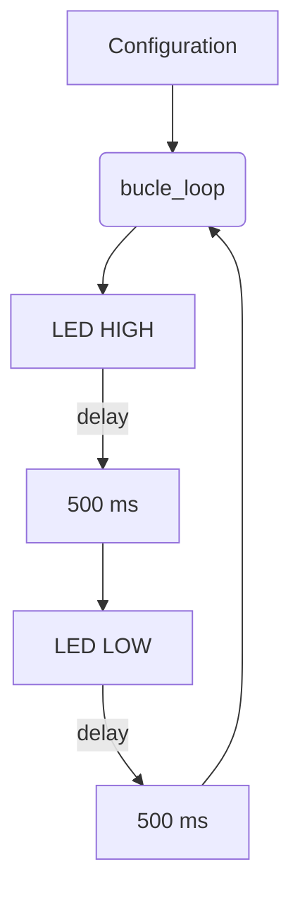
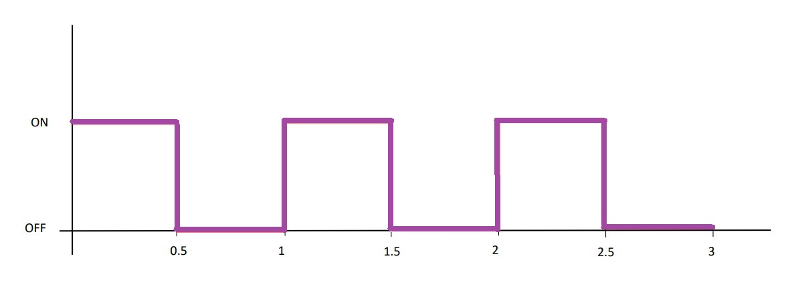

Nerea González 
# Pràctica 1: BLINK 

>Objetivo: producir parpadeo periodico de un led. Se utilizara la salida serie para depurar el programa 📋
## Funcionalidad de la práctica
---------------------------------
1. Iniciar pin de led como salida
2. Iniciar el terminal serie
3. Bucle infinito
encender led
sacar por puerto serie mensaje ON
espera de 500 milisegundos
apagar led
sacar por puesto serie mensaje OFF
espera de 500 milisegundos

```
#include <Arduino.h>
// NEREA GONZÁLEZ 

void setup() {
    pinMode(LED_BUILTIN, OUTPUT);
    Serial.begin(115200); 
}
void loop() {
  digitalWrite(LED_BUILTIN, HIGH); //turn the LED ON (HIGH is the voltage level)
  delay(500);                       //wait for a second
  digitalWrite(LED_BUILTIN, LOW); // turn the LED OFF by making the voltage LOW
  delay(500); //wait for a second
  Serial.println(LED_BUILTIN);
  }

```


## Uso de pines en ESP32
---------------------------------
> _Ejemplo:_
```
#include <Arduino.h>
int tiempo;

void setup() {
  pinMode(LED_BUILTIN, OUTPUT);
  pinMode(21, OUTPUT);
  pinMode(22, OUTPUT);
  pinMode(23, OUTPUT);
  pinMode(18, OUTPUT);
  pinMode(19, OUTPUT);
  pinMode(17, INPUT);
  Serial.begin(115200);
  tiempo=500;
}

void loop() {
  if(digitalRead(17))
  tiempo =1200;
  else 
  tiempo=400;
  digitalWrite(LED_BUILTIN, HIGH);
  digitalWrite(21,LOW);
  digitalWrite(22,HIGH);
  digitalWrite(23,LOW);
  digitalWrite(18,LOW);
  digitalWrite(19,LOW);
  Serial.println("1");
  delay(tiempo);
}
```

## Responda a la siguiente pregunta:
------------------------------------------------
> _¿En el programa que se ha realizado cual es el tiempo libre que tiene el procesador?_


   El tiempo libre del procesador es el tiempo en el que el procesador no está ejecutando ninguna operación. Por lo tanto, el tiempo en que ejecuta una operación, el procesador está ocupado. Si el programa se ejecuta en bucle, el procesador está ocupado siempre. 

## Ejercicios opcionales 
----------------------------------------------
>_Leer el valor de un convertidor A/D de entrada ; sacarlo por el puerto serie y sacar el
mismo valor por otro pin D/A_

```
 // Conectamos el potenciometro
const int potPin = 34;

// Variable del potenciometro
int potValue = 0;

void setup() {
  Serial.begin(115200);
  delay(1000);
}

}
void loop_adc_to_dac() {
  // Leemos el valor del protenciómetro
  potValue = analogRead(potPin);
  Serial.println(potValue);
  delay(500);

}

```

## Diagrama de flujo



## Diagrama de tiempos


