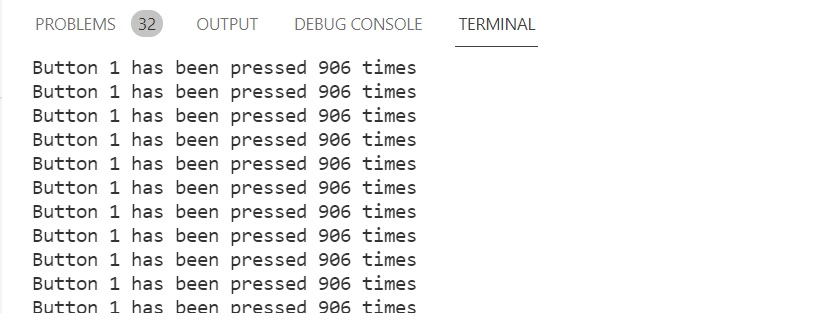
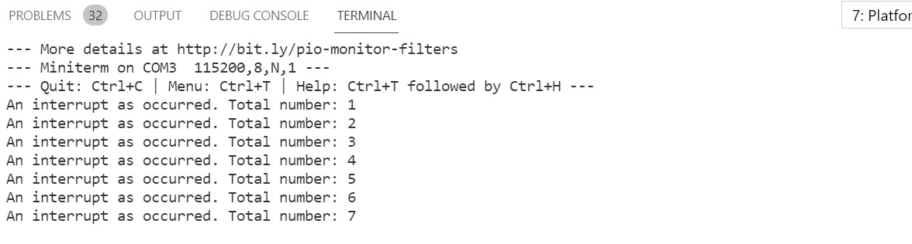

# Pràctica 2A: INTERRUPCIONES
### *Interrupción por interrupción por GPIO*

Objetivo: comprender el funcionamiento de las interrupciones 📋

## Funcionalidad de la práctica
---------------------------------
>Realizar el informe de funcionamiento asi como las salidas que se obtienen a través de la
impresión serie: 

```
struct Button {
const uint8_t PIN;
uint32_t numberKeyPresses;
bool pressed;
};
Button button1 = {18, 0, false};
void IRAM_ATTR isr() {
button1.numberKeyPresses += 1;
button1.pressed = true;
}
void setup() {
Serial.begin(115200);
pinMode(button1.PIN, INPUT_PULLUP);
attachInterrupt(button1.PIN, isr, FALLING);
}
void loop() {
if (button1.pressed) {
Serial.printf("Button 1 has been pressed %u times\n", button1.numberKeyPre
button1.pressed = false;
}
//Detach Interrupt after 1 Minute
static uint32_t lastMillis = 0;
if (millis() - lastMillis > 60000) {
lastMillis = millis();
detachInterrupt(button1.PIN);
Serial.println("Interrupt Detached!");
}
}

```

> Describir la salida por el puerto serie



## Funcionamiento
---------------------------------
>Creamos una estructura denominada Button formada por tres variables:  
Número de pin, número de pulsaciones de teclas y estado de pulsación. 
```
struct Button {
const uint8_t PIN;
uint32_t numberKeyPresses;
bool pressed;
};

```
> Creamos una instancia de la estructura Button, inicializamos el número de pin a 18, el número de pulsaciones de teclas a 0 y el estado de pulsación en false (es el estado por defecto).
```
Button button1 = {18, 0, false};
```
>IRAM_ATTR es la Rutina de Servicio de Interrupción.
En ISR incrementamos el contador de _KeyPresses_ en 1 y ponemos el estado del button pulsado en _True_.

```
void IRAM_ATTR isr() {
button1.numberKeyPresses += 1;
button1.pressed = true;
}
```
>En la sección de configuración del código (void setup), en primer lugar iniciamos la comunicacíon con el ordenador.

>En segundo lugar, indicamos al ESP32 que analice el pin D18. Después llamaremos a IRAM_ATTR isr (la rutina de servicio) cuando el pin vaya de HIGH a LOW. 


```
void setup() {
Serial.begin(115200);
pinMode(button1.PIN, INPUT_PULLUP);
attachInterrupt(button1.PIN, isr, FALLING);
}
```
>Creamos un _loop_ (un bucle), comprobamos si el estado del botón pulsado vuelve a ser verdadero (true). 
Si esto sucede, se imprime el número de tecla que hemos pulsado.
Ponemos el estado de botón pulsado LOW para que la placa pueda seguir leyendo instrucciones. 
```
void loop() {
if (button1.pressed) {
Serial.printf("Button 1 has been pressed %u times\n", button1.numberKeyPre
button1.pressed = false;
}
```
>En el loop también comprobamos el número de milisegundos que han pasado: desde que el programa empieza a usar la función _millis()_. 
>Una vez el tiempo es superior a 60.000 milisegundos le decimos a ESP32 que no utilice el pin D18 utilizando la función de detachInterrupt().

```
//Detach Interrupt after 1 Minute
static uint32_t lastMillis = 0;
if (millis() - lastMillis > 60000) {
lastMillis = millis();
detachInterrupt(button1.PIN);
Serial.println("Interrupt Detached!");
```

