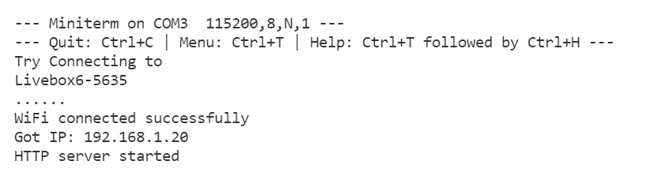
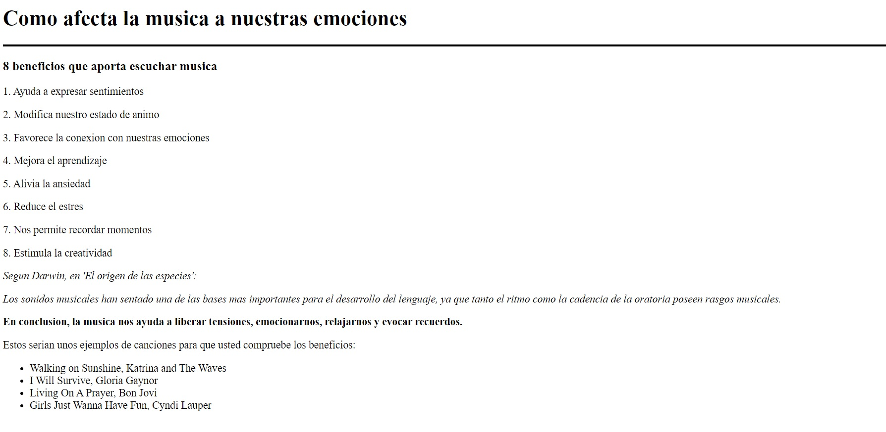

Nerea González 
# Practica 3: Wifi

>Objetivo: Comprender el funcionamiento de WIFI Y BT.
Generaremos un web server utilizando
nuestra ESP32 y tambien una comunicación serie con una aplicación de un móvil con BT .

 📋
## Práctica A: Generación de una web
---------------------------------
1. Realizar el informe de funcionamiento así como la salida por el terminal y la visualización de la conexión a la pagina web con un navegador

2. Modificar la pagina web generando un fichero HTML con el editor Mark down e incluirlo
en el codigo . Incluir un fichero adicional que solo incluya la pagina html
3. Generar informe y codigo en Github

> Generaremos el informe del siguiente código:

```
#include <WiFi.h>
#include <WebServer.h>

// SSID & Password
const char* ssid = "Livebox6-56**";  // Enter your SSID here
const char* password = "*******";  //Enter your Password here
WebServer server(80);  // Object of WebServer(HTTP port, 80 is defult)
// HTML & CSS contents which display on web server 
String HTML = "<!DOCTYPE html>\
<html>\
<body>\
    <h1>Como afecta la música a nuestras emociones;</h1>\
    <h3>8 beneficios que aporta escuchar música;</h3>\
    <p>1. Ayuda a expresar sentimientos ;</p>\
    <p>2. Modifica nuestro estado de ánimo;</p>\
    <p>3. Favorece la conexion con nuestras emociones;</p>\
    <p>4. Mejora el aprendizaje;</p>\
    <p>5. Alivia la ansiedad;</p>\
    <p>6. Reduce el estrés;</p>\
    <p>7. Nos permite recordar momentos;</p>\
    <p>8. Estimula la creatividad;</p>\
    <p> </p>\
    <p>Según Darwin, en 'El origen de las especies':;</p>\
    <p>Los sonidos musicales han sentado una de las bases más importantes;</p>\
    <p>para el desarrollo del lenguaje, ya que tanto el ritmo como la cadencia;</p>\
    <p>de la oratoria poseen rasgos musicales.;</p>\
    <p>En conclusión, la música nos ayuda a liberar tensiones, emocionarnos,;</p>\
    <p>relajarnos y evocar recuerdos.;</p>\
</body>\
</html>";


// Handle root url (/)
void handle_root() {
server.send(200, "text/html", HTML);
}
void setup() {
Serial.begin(115200);
Serial.println("Try Connecting to ");
Serial.println(ssid);
// Connect to your wi-fi modem
WiFi.begin(ssid, password);
// Check wi-fi is connected to wi-fi network
while (WiFi.status() != WL_CONNECTED) {
delay(1000);
Serial.print(".");
}
Serial.println("");
Serial.println("WiFi connected successfully");
Serial.print("Got IP: ");
Serial.println(WiFi.localIP());  //Show ESP32 IP on serial
server.on("/", handle_root);
server.begin();
Serial.println("HTTP server started");
delay(100);
}
void loop() {
server.handleClient();
}
```

Incluimos las librerías necesarias para nuestro programa Wifi, así como Wifi.h, que proporcionará métodos específicos de ESP32 para conectarnos a la red, y la biblioteca WebServer.h, que configurarán un servidor y manejarán solicitudes de HTTP entrantes. 

```
#include <WiFi.h>
#include <WebServer.h>
```

Escribimos el *SSID* y la respectiva contraseña del router al que nos queremos conectar.

```
// SSID & Password
const char* ssid = "Livebox6-56**";  // Enter your SSID here
const char* password = "******";  //Enter your Password here
```
Creamos un objeto de la biblioteca WebServer. El constructor de este objeto toma el puerto  como parámetro, es el puerto donde estará escuchando el servidor.
>Según las especificaciones de ESP32, 80 es el puerto predeterminado para HTTP, por lo tanto, usaremos este valor. 

Una vez hecho esto, ya se puede acceder al servidor sin tener que especificar el puerto en la URL.

```
WebServer server(80);  // Object of WebServer(HTTP port, 80 is defult)
```
La primera declaración siempre debe ser <! DOCTYPE> que indica que estamos enviando código HTML.

Escribimos con código HTML para desarrollar nuestra web. En este caso, hemos escrito una pequeña web que habla sobre cómo afecta la música a nuestras emociones. 

>'html' permite crear la inicialización del código. 'body' indica que comenzaremos a escribir el cuerpo de nuestro texto. 'h1'y 'h3' son funciones que permiten escribir títulos de tamaños diferentes, 'p' indica que habrá un párrafo.

```
// HTML & CSS contents which display on web server 
String HTML = "<!DOCTYPE html>\
<html>\
<body>\
    <h1>Como afecta la musica a nuestras emociones</h1>\
    <hr color='black' size=3>\
        <h3>8 beneficios que aporta escuchar musica</h3>\
            <p>1. Ayuda a expresar sentimientos</p>\
            <p>2. Modifica nuestro estado de animo</p>\
            <p>3. Favorece la conexion con nuestras emociones</p>\
            <p>4. Mejora el aprendizaje</p>\
            <p>5. Alivia la ansiedad</p>\
            <p>6. Reduce el estres</p>\
            <p>7. Nos permite recordar momentos</p>\
            <p>8. Estimula la creatividad</p>\
    <p> </p>\
    <p> </p>\
    <em>Segun Darwin, en 'El origen de las especies':</em>\
    <p> </p>\
    <em>Los sonidos musicales han sentado una de las bases mas importantes</em>\
    <em>para el desarrollo del lenguaje, ya que tanto el ritmo como la cadencia</em>\
    <em>de la oratoria poseen rasgos musicales.</em>\
    </p>\
    >En conclusion, la musica nos ayuda a liberar tensiones, emocionarnos,</strong>\
    <strong>relajarnos y evocar recuerdos.</strong>\
    <p> </p>\
    <p>Estos serian unos ejemplos de canciones para que usted compruebe los beneficios:</p>\
<ul>\
  <li>Walking on Sunshine, Katrina and The Waves</li>\
  <li>I Will Survive, Gloria Gaynor</li>\
  <li>Living On A Prayer, Bon Jovi</li>\
  <li>Girls Just Wanna Have Fun, Cyndi Lauper</li>\
</ul>\
</body>\
</html>";


```

La función *handle_root* se utiliza para buscar la ruta principal (la dirección IP) en el navegador. 
En esta función, se utiliza el método de envío.

>La función envía el código número 200, que significa que la página se abre correctamente, junto con el código HTML que escribimos, para mostrarlo en la página web.

```
// Handle root url (/)
void handle_root() {
server.send(200, "text/html", HTML);
}
```

En la sección de configuración del código (void setup), en primer lugar iniciamos la comunicacíon con el ordenador.

En segundo lugar, indicamos se imprima "Try Connecting to", por último imprimimos el ssid de nuestro router. 
```
void setup() {
Serial.begin(115200);
Serial.println("Try Connecting to ");
Serial.println(ssid);
```
Conectamos el ESP32 al Wifi mediante la función Wifi.begin. Pasaremos por parámetros el ssid del router y su respectiva contraseña.

```
// Connect to your wi-fi modem
WiFi.begin(ssid, password);
```
Wifi.status devuelve el estado de la conexión. WL_CONNECTED es asignado cuando se conecta a una red WiFi. Por lo tanto, aquí estamos creando un bucle donde, mientras el estado de la conexión sea diferente a la conexión de una red wifi, se debe hacer una espera de 1000ms e imprimir ".". Es decir, si el programa imprime puntos, significa que la conexión Wifi es errónea.

Imprimimos otros valores por pantalla como "WiFi connected successfully", "Got IP: ", "WiFi.localIP()"...

Una vez veamos por pantalla la IP de nuestro wifi, pondremos esta IP en el navegador y ¡visualizaremos nuestra web!

*Server.on* hace el ruteo para "/".
```
// Check wi-fi is connected to wi-fi network
while (WiFi.status() != WL_CONNECTED) {
delay(1000);
Serial.print(".");
}
Serial.println("");
Serial.println("WiFi connected successfully");
Serial.print("Got IP: ");
Serial.println(WiFi.localIP());  //Show ESP32 IP on serial
server.on("/", handle_root);
server.begin();
Serial.println("HTTP server started");
delay(100);
}
```
Creamos un loop (bucle), la función handleClient () monitorea la presencia de un cliente y entrega la página HTML solicitada. 

```
void loop() {
server.handleClient();
}
```

>Si la compilación del proceso es "Success", deberemos abrir el monitor de Platformio y comprobar que este proceso también ha sido exitoso. Observaremos el IP de nuestro wifi y ya podremos ver la web en el navegador.


>Monitor:




>Web:



## Mejora de nota
Implementamos el código del tutorial.
```
/*
   Based on Neil Kolban example for IDF: https://github.com/nkolban/esp32-snippets/blob/master/cpp_utils/tests/BLE%20Tests/SampleScan.cpp
   Ported to Arduino ESP32 by Evandro Copercini
*/

#include <BLEDevice.h>
#include <BLEUtils.h>
#include <BLEScan.h>
#include <BLEAdvertisedDevice.h>

int scanTime = 5; //In seconds
BLEScan* pBLEScan;

class MyAdvertisedDeviceCallbacks: public BLEAdvertisedDeviceCallbacks {
    void onResult(BLEAdvertisedDevice advertisedDevice) {
      Serial.printf("Advertised Device: %s \n", advertisedDevice.toString().c_str());
    }
};

void setup() {
  Serial.begin(115200);
  Serial.println("Scanning...");

  BLEDevice::init("");
  pBLEScan = BLEDevice::getScan(); //create new scan
  pBLEScan->setAdvertisedDeviceCallbacks(new MyAdvertisedDeviceCallbacks());
  pBLEScan->setActiveScan(true); //active scan uses more power, but get results faster
  pBLEScan->setInterval(100);
  pBLEScan->setWindow(99);  // less or equal setInterval value
}

void loop() {
  // put your main code here, to run repeatedly:
  BLEScanResults foundDevices = pBLEScan->start(scanTime, false);
  Serial.print("Devices found: ");
  Serial.println(foundDevices.getCount());
  Serial.println("Scan done!");
  pBLEScan->clearResults();   // delete results fromBLEScan buffer to release memory
  delay(2000);
}
```

> Este código inicializa el ESP32 como un dispositivo BLE y busca dispositivos cercanos. 
>Si nuestro sistema operativo es IOS, nos conectaremos mediante la app Blueterm. 