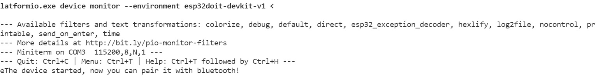
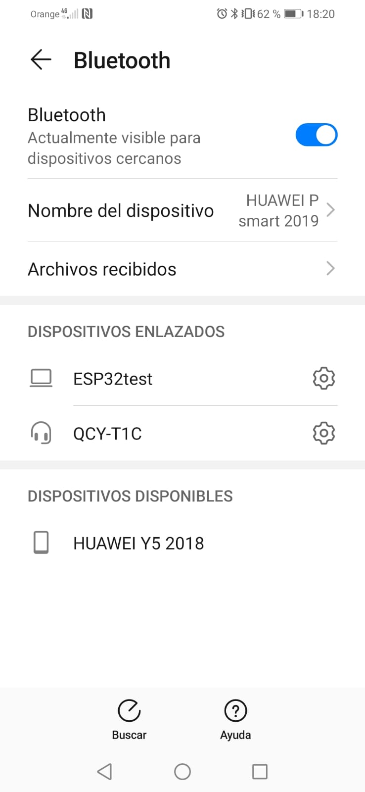

Nerea González 
# Practica 3: Bluetooth

>Objetivo: Comprender el funcionamiento de BT.
Generaremos un web server utilizando
nuestra ESP32 y tambien una comunicación serie con una aplicación de un móvil con BT .

 📋
## Práctica B:
---------------------------------
· Código de la práctica 

```
//This example code is in the Public Domain (or CC0 licensed, at your option.)
//By Evandro Copercini - 2018
//
//This example creates a bridge between Serial and Classical Bluetooth (SPP)
//and also demonstrate that SerialBT have the same functionalities of a normal Serial
#include "BluetoothSerial.h"
#if !defined(CONFIG_BT_ENABLED) || !defined(CONFIG_BLUEDROID_ENABLED)
#error Bluetooth is not enabled! Please run `make menuconfig` to and enable it
#endif
BluetoothSerial SerialBT;
void setup() {
Serial.begin(115200);
SerialBT.begin("ESP32test"); //Bluetooth device name
Serial.println("The device started, now you can pair it with bluetooth!");
}
void loop() {
if (Serial.available()) {
SerialBT.write(Serial.read());
}
if (SerialBT.available()) {
Serial.write(SerialBT.read());
}
delay(20);
}
```
Incluimos la librería
necesarias para el funcionamiento Bluetooth. 

```
#include "BluetoothSerial.h"
```

La siguiente líneas habilitan el bluetooth. 
```
#if !defined(CONFIG_BT_ENABLED) || !defined(CONFIG_BLUEDROID_ENABLED)
#error Bluetooth is not enabled! Please run `make menuconfig` to and enable it
#endif
```
Creamos una instancia de bluetooth.

```
BluetoothSerial SerialBT;
```

Iniciamos la configuración con el PC (a una velocidad de 115200 baudios). 

Escribimos el nombre del dispositivo de bluetooth, en este caso es 'ESP32Test'.
```
void setup() {
Serial.begin(115200);
SerialBT.begin("ESP32test"); //Bluetooth device name
Serial.println("The device started, now you can pair it with bluetooth!");
}
```
El bucle se encarga de enviar y recibir datos a través de Bluetooth Serial.
```
void loop() {
if (Serial.available()) {
SerialBT.write(Serial.read());
}
```
Por último, se verificará si hay datos disponibles en el monitor en serie, si es así, enviará los datos al dispositivo Bluetooth mediante el Bluetooth de nuestro ESP32.

> SerialBT.write () envía datos utilizando el serial bluetooth.

>Serial.read () devuelve los datos recibidos en el puerto serie

```
if (SerialBT.available()) {
Serial.write(SerialBT.read());
}
delay(20);
}
```

>Salida: 



>Dispositivo enlazado: 



