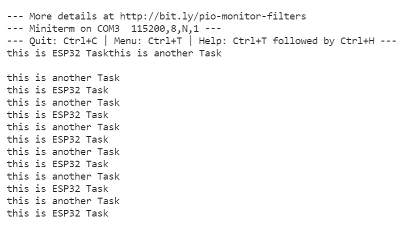
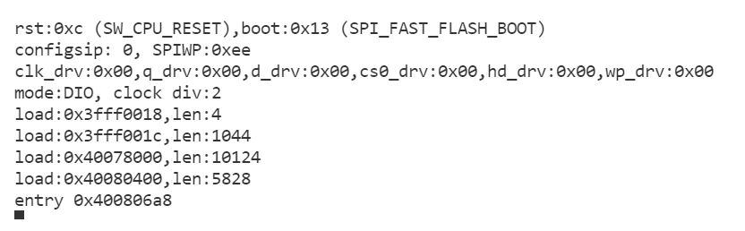

Nerea González 
# Práctica 4: SISTEMAS OPERATIVOS EN TIEMPO REAL

>Objetivo: Comprender el funcionamiento de un sistema operativo en tiempo
Real . Para lo cual realizaremos una practica donde generaremos varias tareas y veremos como se
ejecutan dividiendo el tiempo de uso de la cpu.

> ¿Qué sucede si está utilizando una pantalla de tinta electrónica que tarda unos segundos en actualizarse? 
Lo que sucede es que la pantalla está llevando a cabo multitareas pero necesita un intervalo de tiempo para procesarlas en la cpu, puesto que está llevando las tareas a la vez y no una tras otra. 
## Funcionalidad de la práctica
---------------------------------
>1. Describir la salida por el puerto serie
>2. Explicar el funcionamiento


>1. Describir la salida por el puerto serie



>2. Explicar el funcionamiento

```
#include <Arduino.h>

void anotherTask( void * parameter ){
  for(;;){
    Serial.println("this is another Task");
    delay(1000);
  }  
}

void setup()
{
  Serial.begin(112500);
  xTaskCreate(
  anotherTask, 
  "another Task", 
  10000, 
  NULL, 
  1, 
  NULL); 
}

void loop()
{
  Serial.println("this is ESP32 Task");
  delay(1000);
}
```


>Este código está creando una tarea y ejecutándola en bucle infinito(for (;;)). 
Definimos la librería y creamos una función void. 
 
> Imprimimos que "esta es otra tarea" y le añadimos un retardo(delay) de 1000 ms de nuevo.

```
#include <Arduino.h>

void anotherTask( void * parameter ){
  for(;;){
    Serial.println("this is another Task");
    delay(1000);
  }  
}
```
>Con serial.begin definimos la velocidad de datos en bits por segundo (baudios) para la transmisión de datos en serie.

> Declaramos xTaskCreate, que se encarga de crear una nueva tarea,el programador es
libre de elegir en qué núcleo ejecuta esta tarea. El siguiente paso es definir la tarea y denominar el nombre de esta. 

```

void setup()
{
  Serial.begin(112500);
  xTaskCreate(
  anotherTask, 
  "another Task", 
  10000, 
  NULL, 
  1, 
  NULL); 
}

```


> Creamos un bucle que imprima "Esta es la tarea del ESP32"
y añadimos un retardo(delay) de 1000 ms.

```
void loop()
{
  Serial.println("this is ESP32 Task");
  delay(1000);
}
```


## Ejercicio 2 

> A realizar como ejercicio en casa
1. Realizar un programa que utilice dos tareas una enciende un led y otra lo apaga. Dichas tareas deben estar sincronizadas

```

#include <Arduino_FreeRTOS.h>
#include <semphr.h>
long debouncing_time = 150; 
volatile unsigned long last_micros;
 
SemaphoreHandle_t interruptleds;
 
void setup() {
  pinMode(2, INPUT_PULLUP);
  xTaskCreate(TaskLed,  "Led", 128, NULL, 0, NULL );
xTaskCreate(TaskBlink,  "LedBlink", 128, NULL, 0, NULL );
  interruptleds = xSemaphoreCreateBinary();
  if (interruptleds != NULL) {
    attachInterrupt(digitalPinToInterrupt(2), debounceInterrupt, LOW);
  }
}
 
void loop() {}
 
void interruptHandler() {
  xSemaphoreGiveFromISR(interruptleds, NULL);
}
 
void TaskLed(void *pvParameters)
{
  (void) pvParameters;
  pinMode(8, OUTPUT);
  for (;;) {
    if (xSemaphoreTake(interruptleds, portMAX_DELAY) == pdPASS) {
      digitalWrite(8, !digitalRead(8));
    }
  }
}
void TaskBlink(void *pvParameters)
{
  (void) pvParameters;
  pinMode(7, OUTPUT);
  for (;;) {
      digitalWrite(7, HIGH);
      vTaskDelay(200 / portTICK_PERIOD_MS);
      digitalWrite(7, LOW);
      vTaskDelay(200 / portTICK_PERIOD_MS);
  }
}
void debounceInterrupt() {
  if((long)(micros() - last_micros) >= debouncing_time * 1000) {
    interruptHandler();
    last_micros = micros();
  }
}
```

>Salida:
